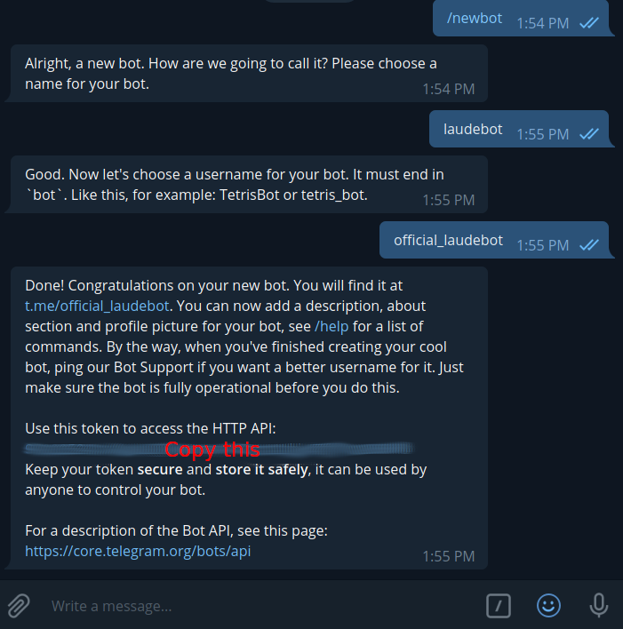
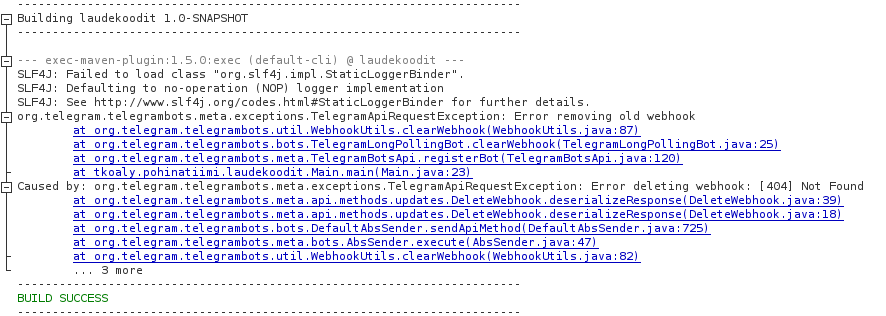

# Welcome to Laudekoodit 2020

## Requirements

  - Telegram
  - Working version of java
  - git
  - Code editor such as Netbeans or vscode

## Creating your first bot

1. Go to https://telegram.me/BotFather
2. Send message '/newbot'
3. Follow instructions

Your conversation should look something like this

You can now start messaging your bot but as expected it does not answer anything. Start by forking this repository onto your own computer. This can be done by clicking the fork button on the github page.

## Connecting your bot

Open up this project on your favorite code editor. Inside src/main/java/tkoaly/pohinatiimi/laudekoodit are the files we are gonna be working with. Especially LaudeBot.java.

### Set bot username

Next open up LaudeBot.java and insert the username you gave your bot into to the getBotUsername -method.

If your bots username is official_laudebot the method should look like below

### Set bot token as an environment variable

The project is set up so that it looks for an environment variable for the bot token. We need to setup a environment variable on our computer so it works. 

**On linux/macos run the following command without the [] brackets**

    echo export [INSERT VARIABLE NAME HERE]=[INSET TOKEN HERE] >> ~/.bashrc

After this you may need to restart your computer

### Insert the variable

You've probably already guessed but next you need to insert the variable you just made into source-code. If you named your variable LAUDEBOT_TOKEN it should look like this

**Congratulations! Your bot should now be working!!**

### More information

Visit https://github.com/rubenlagus/TelegramBots/wiki for more information

### Errors

If you get an error like below it means your token is not setup right. Remember to restart your computer after updating .bashrc

